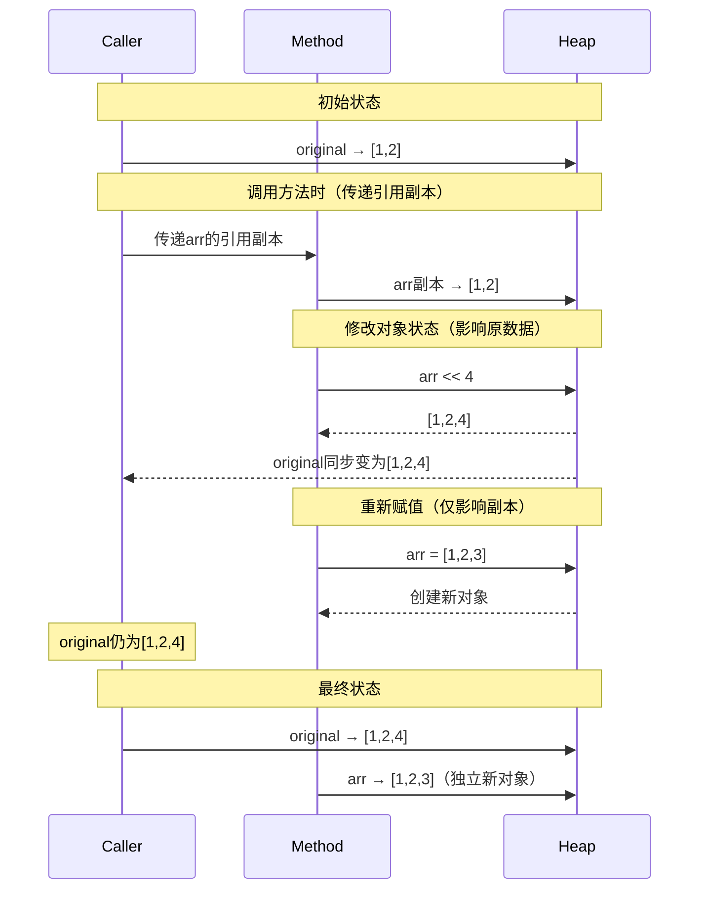

+++
date = '2025-05-13T18:21:25+08:00'
draft = false
title = 'Ruby参数传递与对象引用'
mermaid = true
+++

我们来举一个好玩的例子：

```ruby
def modify_arr(b)
	b << 4
	b = [1, 2, 3]
end

a = [1, 2]
modify_arr a

puts a
```

以上的代码最终会打印出什么？

大部分情况下，对ruby对象不熟悉的人，可能会说`[1, 2, 3]`，但事实恰恰相反：结果是`[1, 2, 4]`！

为什么会出现这样的情况？其实当参数`arr`被传递到函数中后，传递的仅仅是数组对象地址的引用，而非数组本身。但是在ruby中，对数组进行操作会修改数组对象本身，而赋值操作仅仅是将引用进行了新的对象创建，就算你在函数中返回了该引用，也是一个新的对象，而非原本的`a`本身。

以下时序图很好的反应了整个操作流程：



虽然这是一个很好的例子，但是善于思考的人会提出一个问题：**如果我在函数中返回了`b`，`b`还指向`a`吗？**

很抱歉，他们之间没关系了。从函数传入的`b`，它只是对`a`内存地址的引用。而对`b`赋值并在函数退出前返回，`b`会被分配新的内存地址，它就是一个全新的对象了。

那原来的对象会被Ruby的垃圾回收机制回收吗？这就是后续需要讨论的问题了。